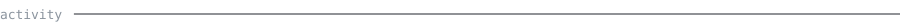
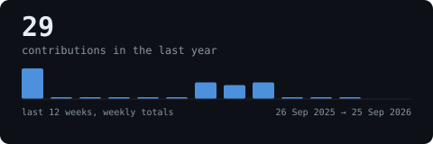
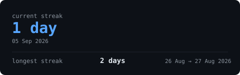
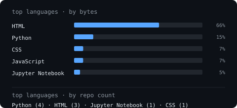
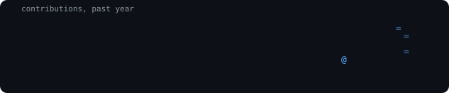

<!--
  Portrait slot — reserved for later. Run scripts/generate_portrait.py with
  a photo (see SETUP.md), then uncomment this block. Left out for now
  rather than pointing at a file that doesn't exist yet.

  <picture>
    
  </picture>
    
-->

<samp>naman agarwal</samp>
 
ml engineer, building the dashboards and models to back it — plant disease diagnosis, audio captioning, live sports data (F1, IPL)

  

 

  

  

  

  

<blockquote>
still early — most of what's here started in the last few months. the plan
is more depth on the ML side (past MobileNetV2 + Phi-3-mini) and dashboards
that don't need a backend to feel fast.
  
every graphic above is generated inside this repository by a scheduled
action, straight from the GitHub API — no third-party stats services,
nothing that can rate-limit or go dark.
</blockquote>
